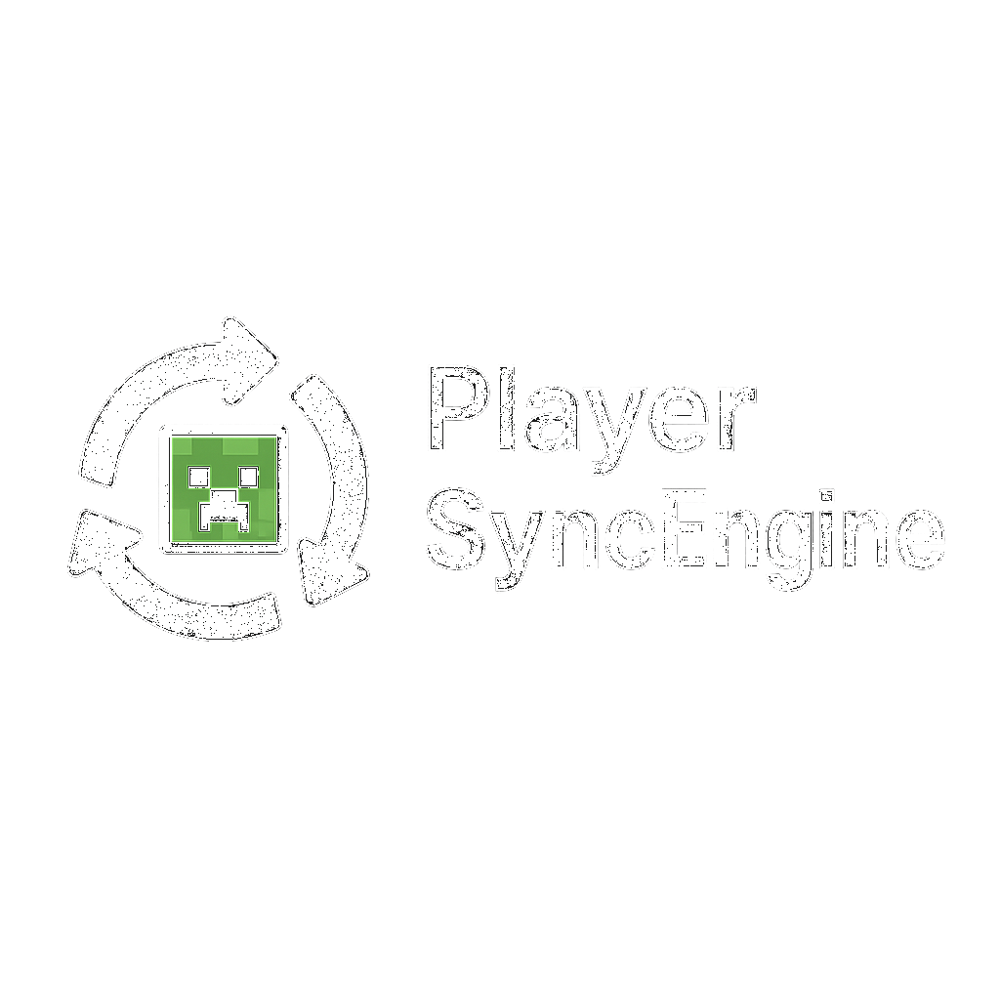

    
      
    
🔄 A proof of concept engine to sync multiple Minecraft server instances together.

## Overview

PlayerSyncEngine synchronizes player data across multiple Minecraft servers in real-time, enabling features like cross-server tab lists, live chat, and visible player presence. Everything works seamlessly, giving the impression of a single, continuous world.

With a lightweight architecture and a feature-rich API, it's designed for high performance and easy extensibility. Support for orchestration layers means servers can be dynamically spun up or down as needed, making it ideal for scalable, cloud-native deployments.

Whether you're managing a handful of game modes or running a large network, this system keeps players connected — no matter where they are.

## Structure

This is a multi-module Maven project structured into several layers, each with a distinct responsibility:
- **`data/`** – The shared data layer. Contains common models, database implementations, and utilities used throughout the project.
- **`orchestration/`** – The orchestration layer utilizing Docker. Handles automated server lifecycle management, including dynamically spinning servers up or down based on demand.
- **`engine/`** – The core sync engine. Responsible for synchronizing critical systems like chat, tablist, and physical player movement between servers.  
  Redis is used as the internal messaging channel for real-time communication between nodes, while MongoDB stores persistent player data such as inventories, health, location, and more.
- **`metrics/`** – The global metrics layer utilizing InfluxDB. Aggregates and exposes metrics across the entire cluster — including all game servers, orchestration events, and sync operations — to provide full visibility into system health and performance.
- **`plugin/`** – The Spigot plugin. Gathers and reports server-specific metrics like TPS, whitelist status, and player counts.