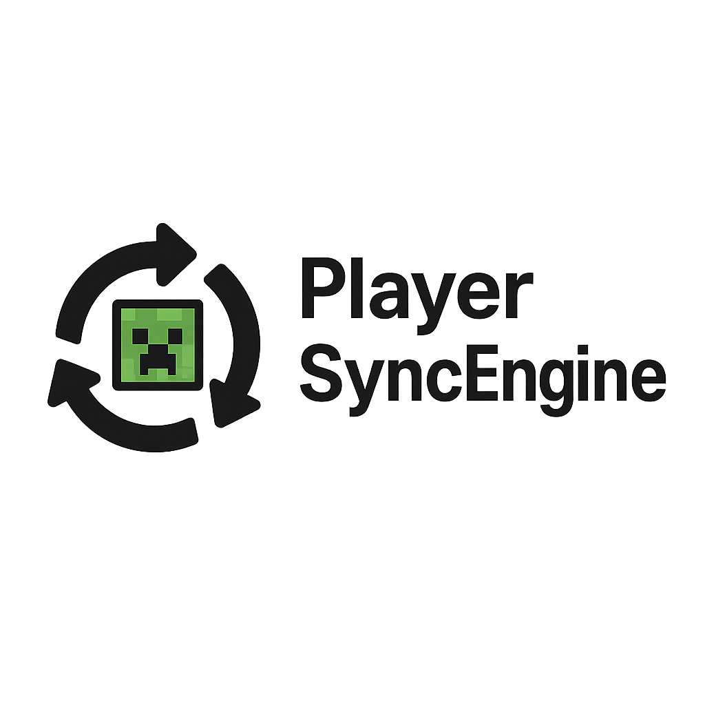

    
      
    
🔄 A proof of concept plugin to sync multiple Minecraft server instances together.

## Overview

PlayerSyncEngine synchronizes player data across multiple Minecraft servers in real-time, enabling features like cross-server tab lists, live chat, and visible player presence. Everything works seamlessly, giving the impression of a single, continuous world.

With a lightweight architecture and a feature-rich API, it's designed for high performance and easy extensibility. Support for orchestration layers means servers can be dynamically spun up or down as needed, making it ideal for scalable, cloud-native deployments.

Whether you're managing a handful of game modes or running a large network, this system keeps players connected — no matter where they are.

## Structure

This is a multi-module Maven project structured into several layers, each with a distinct responsibility:
- **`data/`** – The shared data layer. Contains common models, database implementations, and utilities used throughout the project.
- **`plugin/`** – The Paper plugin. Handles synchronization of critical systems like chat, tablist, and physical player movement between servers. Redis serves dual purposes: as the internal messaging channel for real-time communication between plugin instances, and as the primary data store for player data (inventories, health, last location, etc.) enabling fast cross-server transfers. Also gathers and reports server-specific metrics like TPS, whitelist status, and player counts.
- [not started] **`metrics/`** – The global metrics layer utilizing InfluxDB. Aggregates and exposes metrics across the entire cluster — including all game servers, orchestration events, and sync operations — to provide full visibility into system health and performance.

## Currently Synced
- [x] Server Statuses
- [ ] Connected Players
- [ ] Chat (With key verification?)
- [ ] Tablist
- [ ] Health
- [ ] Food Level
- [ ] Inventories
- [ ] Realtime (Movement, Sneaking, Swimming, etc.)?
- [ ] Blocks?
- [ ] World Stats?
- [ ] World Time / Weather?
- [ ] Advancements?

## Environment Variables

| Name                       | Description                                                               | Default                  |
|----------------------------|---------------------------------------------------------------------------|--------------------------|
| `REDIS_URI`                | The URI of the Redis server to connect to.                                | `redis://localhost:6379` |
| `REDIS_PUBLISHING_THREADS` | The number of threads to use for publishing messages to the message bus.  | `8`                      |
| `REDIS_RECEIVING_THREADS`  | The number of threads to use for receiving messages from the message bus. | `4`                      |
| `SERVER_GROUP`             | The group this server is in.                                              | `default`                |
| `SERVER_REGION`            | The region this server is in.                                             | `NA`                     |

## Roadmap
- [ ] MongoDB integration for cold storage of inactive player data
- [ ] A tool to benchmark the performance
- [ ] ...
